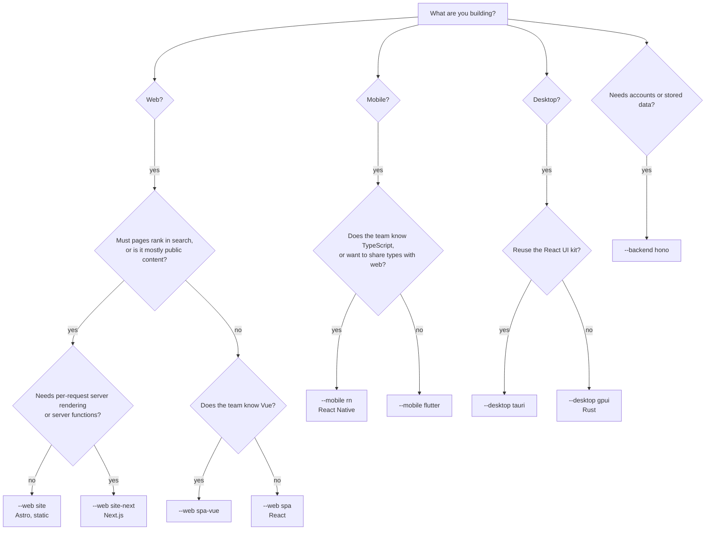

# Which stack should I pick?

```mermaid
flowchart TD
  S["What are you building?"] --> W{"Web?"}
  W -- yes --> W1{"Must pages rank in search,<br/>or is it mostly public content?"}
  W1 -- yes --> W2{"Needs per-request server rendering<br/>or server functions?"}
  W2 -- no --> SITE["--web site<br/>Astro, static"]
  W2 -- yes --> NEXT["--web site-next<br/>Next.js"]
  W1 -- no --> W3{"Does the team know Vue?"}
  W3 -- yes --> VUE["--web spa-vue"]
  W3 -- no --> SPA["--web spa<br/>React"]
  S --> M{"Mobile?"}
  M -- yes --> M1{"Does the team know TypeScript,<br/>or want to share types with web?"}
  M1 -- yes --> RN["--mobile rn<br/>React Native"]
  M1 -- no --> FL["--mobile flutter"]
  S --> DK{"Desktop?"}
  DK -- yes --> D1{"Reuse the React UI kit?"}
  D1 -- yes --> TA["--desktop tauri"]
  D1 -- no --> GP["--desktop gpui<br/>Rust"]
  S --> B{"Needs accounts or stored data?"}
  B -- yes --> BE["--backend hono"]
```

Both a public site and a product app is fine: `--web site,spa`. You can add apps later with `deno task add-app`.
