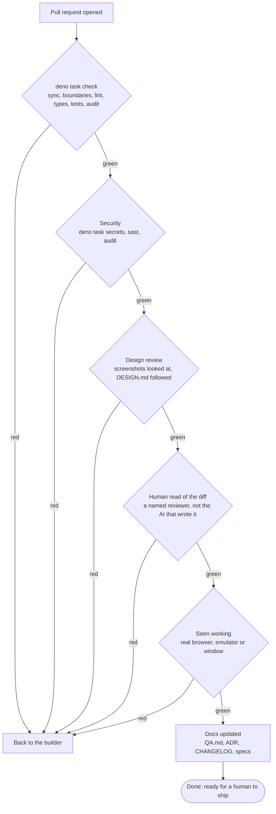

# Definition of Done: the gate flow

A change is done only when every gate is green. A red gate sends it back to the builder.

```mermaid
flowchart TD
  A["Pull request opened"] --> B{"deno task check<br/>sync, boundaries, lint, types, tests, audit"}
  B -- red --> X["Back to the builder"]
  B -- green --> C{"Security<br/>deno task secrets, sast, audit"}
  C -- red --> X
  C -- green --> D{"Design review<br/>screenshots looked at, DESIGN.md followed"}
  D -- red --> X
  D -- green --> E{"Human read of the diff<br/>a named reviewer, not the AI that wrote it"}
  E -- red --> X
  E -- green --> F{"Seen working<br/>real browser, emulator or window"}
  F -- red --> X
  F -- green --> G["Docs updated<br/>QA.md, ADR, CHANGELOG, specs"]
  G --> H(["Done: ready for a human to ship"])
```
