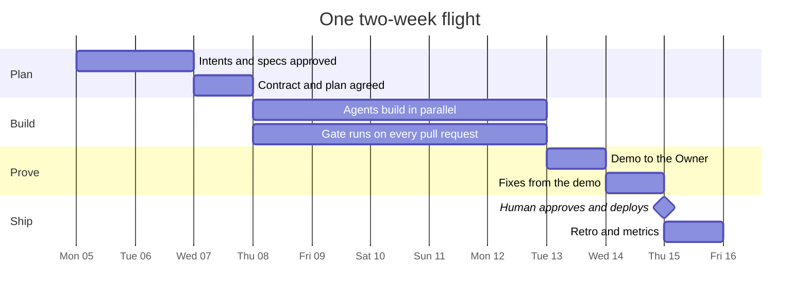

# A flight (sprint) timeline

A flight is 1 to 2 weeks for a team. Solo developers run the same shape as a daily loop (see METHOD.md).

```mermaid
gantt
  title One two-week flight
  dateFormat YYYY-MM-DD
  axisFormat %a %d
  section Plan
  Intents and specs approved      :a1, 2026-01-05, 2d
  Contract and plan agreed        :a2, after a1, 1d
  section Build
  Agents build in parallel        :b1, after a2, 5d
  Gate runs on every pull request :b2, after a2, 5d
  section Prove
  Demo to the Owner               :c1, after b1, 1d
  Fixes from the demo             :c2, after c1, 1d
  section Ship
  Human approves and deploys      :milestone, d1, after c2, 0d
  Retro and metrics               :d2, after c2, 1d
```

The dates are placeholders. `PLAN.md` holds the real ones.
