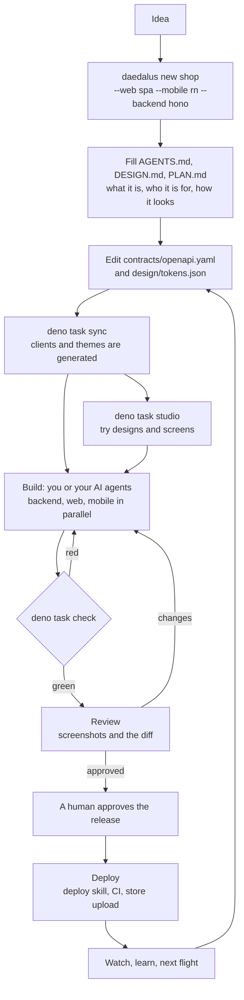

# From idea to shipped app

The whole journey with the real commands.

```mermaid
flowchart TD
  A["Idea"] --> B["daedalus new shop<br/>--web spa --mobile rn --backend hono"]
  B --> C["Fill AGENTS.md, DESIGN.md, PLAN.md<br/>what it is, who it is for, how it looks"]
  C --> D["Edit contracts/openapi.yaml<br/>and design/tokens.json"]
  D --> E["deno task sync<br/>clients and themes are generated"]
  E --> F["deno task studio<br/>try designs and screens"]
  E --> G["Build: you or your AI agents<br/>backend, web, mobile in parallel"]
  F --> G
  G --> H{"deno task check"}
  H -- red --> G
  H -- green --> I["Review<br/>screenshots and the diff"]
  I -- changes --> G
  I -- approved --> J["A human approves the release"]
  J --> K["Deploy<br/>deploy skill, CI, store upload"]
  K --> L["Watch, learn, next flight"]
  L --> D
```
