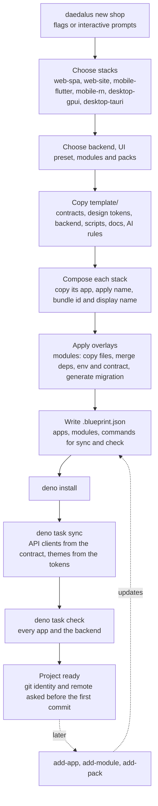

# Generator flow

```mermaid
flowchart TD
  A["daedalus new shop<br/>flags or interactive prompts"] --> B["Choose stacks<br/>web-spa, web-site, mobile-flutter, mobile-rn, desktop-gpui, desktop-tauri"]
  B --> C["Choose backend, UI preset, modules and packs"]
  C --> D["Copy template/<br/>contracts, design tokens, backend, scripts, docs, AI rules"]
  D --> E["Compose each stack<br/>copy its app, apply name, bundle id and display name"]
  E --> F["Apply overlays<br/>modules: copy files, merge deps, env and contract, generate migration"]
  F --> G["Write .blueprint.json<br/>apps, modules, commands for sync and check"]
  G --> H["deno install"]
  H --> I["deno task sync<br/>API clients from the contract, themes from the tokens"]
  I --> J["deno task check<br/>every app and the backend"]
  J --> K["Project ready<br/>git identity and remote asked before the first commit"]
  K -. later .-> L["add-app, add-module, add-pack"]
  L -. updates .-> G
```

Everything after the copy is driven by the manifest, so `deno task sync` and `deno task check` always cover exactly the
apps and modules the project has.
